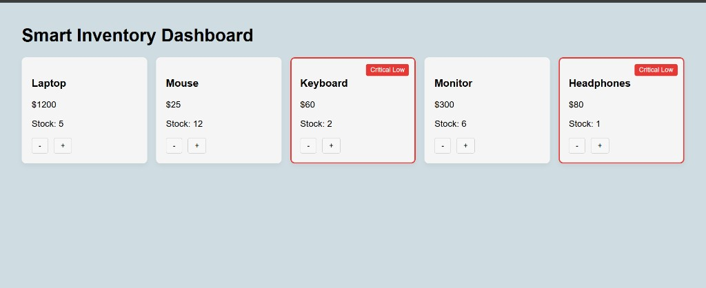

# Smart Inventory Dashboard

A full-stack inventory management dashboard for tracking product stock levels in real time. The app surfaces low-stock items automatically so teams can restock before shelves run empty.



## Live Demo

- **Frontend:** https://smart-inventory-dashboard-rho.vercel.app/
- **Backend API:** https://smart-inventory-dashboard-jotj.onrender.com/products

## Overview

Smart Inventory Dashboard is a lightweight web application built with a React frontend and an Express REST API. It displays products in a responsive card grid, lets users adjust stock with increment/decrement controls, and highlights items that fall below their configured threshold with a **Critical Low** badge and red border.

This project is well suited for small retail operations, warehouse demos, or as a starter template for inventory tooling.

## Features

- **Live inventory view** — Product name, price, and current stock on a clean card layout
- **Stock adjustments** — Increase or decrease quantity directly from the dashboard
- **Smart low-stock alerts** — Items below their `lowStockThreshold` are flagged as *Critical Low*
- **Per-product thresholds** — Each product defines its own reorder warning level
- **Responsive UI** — Grid layout adapts to different screen sizes
- **REST API backend** — Simple endpoints for fetching products and updating stock

## Tech Stack

| Layer    | Technology                          |
| -------- | ----------------------------------- |
| Frontend | React 19, Vite 7                    |
| Backend  | Node.js, Express 5                  |
| Styling  | CSS (custom, no UI framework)       |
| Data     | In-memory product store             |
| Deploy   | Vercel (frontend), Render (backend) |

## Project Structure

```
smart-inventory-dashboard/
├── backend/
│   ├── server.js          # Express server and API routes
│   ├── products.js        # Seed product data
│   └── package.json
├── frontend/
│   └── smart-inventory/
│       ├── src/
│       │   ├── App.jsx              # Root component and state
│       │   ├── api.js               # API client
│       │   └── components/
│       │       ├── ProductCard.jsx  # Single product card with alerts
│       │       └── ProductGrid.jsx  # Responsive product grid
│       ├── .env                     # Frontend environment variables
│       └── package.json
└── docs/
    └── dashboard-preview.png
```

## Getting Started

### Prerequisites

- [Node.js](https://nodejs.org/) 18 or later
- npm (included with Node.js)

### 1. Clone the repository

```bash
git clone https://github.com/Alwin-385/smart-inventory-dashboard.git
cd smart-inventory-dashboard
```

### 2. Start the backend

```bash
cd backend
npm install
npm start
```

The API runs at `http://localhost:5000` by default.

### 3. Start the frontend

In a new terminal:

```bash
cd frontend/smart-inventory
npm install
```

Create a `.env` file in `frontend/smart-inventory/`:

```env
VITE_API_URL=http://localhost:5000
```

Then start the dev server:

```bash
npm run dev
```

Open the URL shown in the terminal (typically `http://localhost:5173`).

## Environment Variables

| Variable        | Location                    | Description              |
| --------------- | --------------------------- | ------------------------ |
| `VITE_API_URL`  | `frontend/smart-inventory/` | Base URL of the REST API |
| `PORT`          | Backend (optional)          | API port (default: 5000) |

## API Reference

### `GET /products`

Returns all products.

**Response example:**

```json
[
  {
    "id": 1,
    "name": "Laptop",
    "price": 1200,
    "stock": 5,
    "lowStockThreshold": 3
  }
]
```

### `POST /update-stock`

Updates the stock quantity for a product.

**Request body:**

```json
{
  "id": 1,
  "newQuantity": 4
}
```

**Responses:**

- `200` — Updated product object
- `400` — Quantity cannot be negative
- `404` — Product not found

## How Low-Stock Alerts Work

Each product includes a `lowStockThreshold`. When `stock < lowStockThreshold`, the card receives:

- A red border
- A **Critical Low** badge in the top-right corner

Example from the seed data: the Keyboard (stock: 2, threshold: 4) and Headphones (stock: 1, threshold: 2) are flagged, while the Laptop (stock: 5, threshold: 3) is not.

The decrement button is disabled when stock reaches zero to prevent invalid quantities.

## Available Scripts

### Backend (`backend/`)

| Command       | Description              |
| ------------- | ------------------------ |
| `npm start`   | Start the Express server |

### Frontend (`frontend/smart-inventory/`)

| Command         | Description                    |
| --------------- | ------------------------------ |
| `npm run dev`   | Start Vite dev server with HMR |
| `npm run build` | Production build               |
| `npm run preview` | Preview production build     |
| `npm run lint`  | Run ESLint                     |

## Deployment

The frontend `.env` can point to a hosted API (for example, a Render deployment). Update `VITE_API_URL` to your production backend URL before building:

```bash
cd frontend/smart-inventory
npm run build
```

Serve the `dist/` folder with any static host. Ensure the backend has CORS enabled for your frontend origin.

## Future Enhancements

- Persistent storage (database) instead of in-memory data
- Authentication and role-based access
- Product search, filtering, and sorting
- Restock history and audit logs
- Configurable alert notifications (email or webhook)
